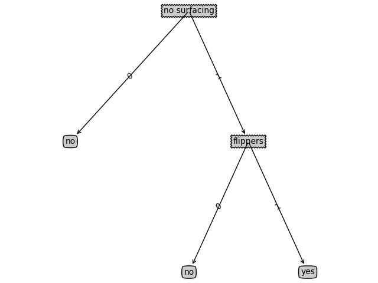

> decision tree algorithm

### 简介
&emsp;上一章我们介绍了关于决策树算法的熵问题，现在结合周志华老师的《机器学习实战》第三章决策树记录自己的学习过程。

### 实战<br />
1. 给定数据为
```python
dataSet = [[1, 1, 'yes'],
               [1, 1, 'yes'],
               [1, 0, 'no'],
               [0, 1, 'no'],
               [0, 1, 'no']]
    labels = ['no surfacing', 'flippers']
```
2. 根据如下方法可以得到具体的树模型
```python
def createTreeOfEntroy(dataSet, labels):
    classList = [example[-1] for example in dataSet]
    if classList.count(classList[0]) == len(classList):
        return classList[0]  # stop splitting when all of the classes are equal
    if len(dataSet[0]) == 1:  # stop splitting when there are no more features in dataSet
        return majorityCnt(classList)
    bestFeat = chooseBestFeatureToSplit(dataSet)
    bestFeatLabel = labels[bestFeat]
    myTree = {bestFeatLabel: {}}
    del (labels[bestFeat])
    featValues = [example[bestFeat] for example in dataSet]
    uniqueVals = set(featValues)
    for value in uniqueVals:
        subLabels = labels[:]  # copy all of labels, so trees don't mess up existing labels
        myTree[bestFeatLabel][value] = createTreeOfEntroy(splitDataSet(dataSet, bestFeat, value), subLabels)
    return myTree
```
其中树模型为：
```python
{‘no surfacing’: {0: ‘no’, 1: {‘flippers’: {0: ‘no’, 1: ‘yes’}}}}
```
然后使用该方法就可以将得到的树模型画出来
```python
def createPlot(inTree):
    fig = plt.figure(1, facecolor='white')
    fig.clf()
    axprops = dict(xticks=[], yticks=[])
    createPlot.ax1 = plt.subplot(111, frameon=False, **axprops)    #no ticks
    plotTree.totalW = float(getNumLeafs(inTree))
    plotTree.totalD = float(getTreeDepth(inTree))
    plotTree.xOff = -0.5/plotTree.totalW;
    plotTree.yOff = 1.0;
    plotTree(inTree, (0.5,1.0), '')
    plt.show()
```
具体图如下所示：<br />


