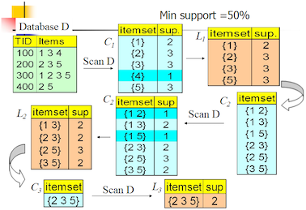
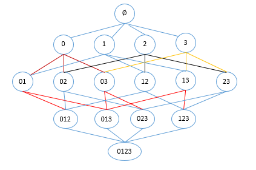
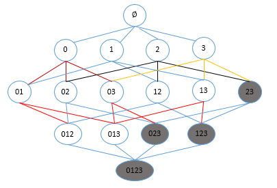
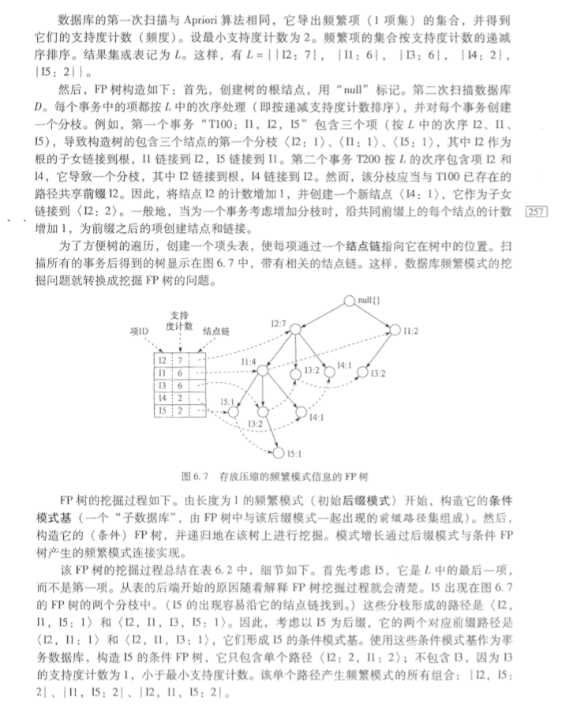
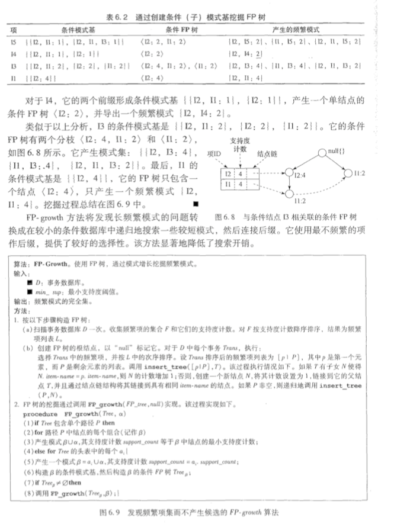

> Apriori algorith

**摘要**

​	先验算法（Apriori Algorithm）是关联规则学习的经典算法之一，常常应用在商业等诸多领域。本文首先介绍什么是Apriori算法，与其相关的基本术语，之后对算法原理进行多方面剖析，其中包括思路、原理、优缺点、流程步骤和应用场景。接着再通过一个实际案例进行语言描述性逐步剖析。至此，读者基本了解该算法思想和过程。紧接着我们进行实验，重点的频繁项集的生成和关联规则的生成。最后我们采用综合实例进行实际演示

## 算法概述

### 简介

Figure 1. Lena

​	Apriori算法是经典的挖掘频繁项集和关联规则的数据挖掘算法。A priori在拉丁语中指"来自以前"。当定义问题时，通常会使用先验知识或者假设，这被称作"一个先验"（apriori）。Apriori算法的名字正是基于这样的事实：算法使用频繁项集性质的先验性质，即频繁项集的所有非空子集也一定是频繁的。Apriori算法使用一种称为逐层搜索的迭代方法，其中k项集用于探索(k+1)项集。首先，通过扫描数据库，累计每个项的计数，并收集满足最小支持度的项，找出频繁1项集的集合。该集合记为L1。然后，使用L1找出频繁2项集的集合L2，使用L2找出L3，如此下去，直到不能再找到频繁k项集。每找出一个Lk需要一次数据库的完整扫描。Apriori算法使用频繁项集的先验性质来压缩搜索空间。

### 应用场景

Apriori 算法广泛应用于各种领域，通过对数据的关联性进行了分析和挖掘，挖掘出的这些信息在决策制定过程中具有重要的参考价值。

- Apriori算法广泛应用于消费市场价格分析中

  它能够很快的求出各种产品之间的价格关系和它们之间的影响。通过数据挖掘，市场商人可以瞄准目标客户，采用个人股票行市、最新信息、特殊的市场推广活动或其他一些特殊的信息手段，从而极大地减少广告预算和增加收入。超市购物数据集，或者电商的网购数据集中，如果我们找到了频繁出现的数据集，那么对于超市，我们可以优化产品的位置摆放，对于电商，我们可以优化商品所在的仓库位置，达到节约成本，增加经济效益的目的。百货商场、超市和一些老字型大小的零售店也在进行数据挖掘，以便猜测这些年来顾客的消费习惯。

- Apriori算法应用于网络安全领域，比如网络入侵检测技术中。

  早期中大型的电脑系统中都收集审计信息来建立跟踪档，这些审计跟踪的目的多是为了性能测试或计费，因此对攻击检测提供的有用信息比较少。它通过模式的学习和训练可以发现网络用户的异常行为模式。采用作用度的Apriori算法削弱了Apriori算法的挖掘结果规则，是网络入侵检测系统可以快速的发现用户的行为模式，能够快速的锁定攻击者，提高了基于关联规则的入侵检测系统的检测性。

- Apriori算法应用于高校管理中。
  随着高校贫困生人数的不断增加，学校管理部门资助工作难度也越加增大。针对这一现象，提出一种基于数据挖掘算法的解决方法。将关联规则的Apriori算法应用到贫困助学体系中，并且针对经典Apriori挖掘算法存在的不足进行改进，先将事务数据库映射为一个布尔矩阵，用一种逐层递增的思想来动态的分配内存进行存储，再利用向量求”与”运算，寻找频繁项集。实验结果表明，改进后的Apriori算法在运行效率上有了很大的提升，挖掘出的规则也可以有效地辅助学校管理部门有针对性的开展贫困助学工作。

- Apriori算法被广泛应用于移动通信领域。

  移动增值业务逐渐成为移动通信市场上最有活力、最具潜力、最受瞩目的业务。随着产业的复苏，越来越多的增值业务表现出强劲的发展势头，呈现出应用多元化、营销品牌化、管理集中化、合作纵深化的特点。针对这种趋势，在关联规则数据挖掘中广泛应用的Apriori算法被很多公司应用。依托某电信运营商正在建设的增值业务Web数据仓库平台，对来自移动增值业务方面的调查数据进行了相关的挖掘处理，从而获得了关于用户行为特征和需求的间接反映市场动态的有用信息，这些信息在指导运营商的业务运营和辅助业务提供商的决策制定等方面具有十分重要的参考价值。

### 算法思想及原理

#### 算法思想

​	对于Apriori算法，我们使用支持度来作为我们判断频繁项集的标准。Apriori算法的目标是找到最大的K项频繁集。这里有两层意思，首先，我们要找到符合支持度标准的频繁集。但是这样的频繁集可能有很多。第二层意思就是我们要找到最大个数的频繁集。比如我们找到符合支持度的频繁集AB和ABE，那么我们会抛弃AB，只保留ABE，因为AB是2项频繁集，而ABE是3项频繁集。那么具体的，Apriori算法是如何做到挖掘K项频繁集的呢？

　　Apriori算法采用了迭代的方法，先搜索出候选1项集及对应的支持度，剪枝去掉低于支持度的1项集，得到频繁1项集。然后对剩下的频繁1项集进行连接，得到候选的频繁2项集，筛选去掉低于支持度的候选频繁2项集，得到真正的频繁二项集，以此类推，迭代下去，直到无法找到频繁k+1项集为止，对应的频繁k项集的集合即为算法的输出结果。

　　可见这个算法还是很简洁的，第i次的迭代过程包括扫描计算候选频繁i项集的支持度，剪枝得到真正频繁i项集和连接生成候选频繁i+1项集三步。

　　我们下面这个简单的例子看看：

​				

​	我们的数据集(库)D有4条记录（事物），分别是134,235,1235和25。现在我们用Apriori算法来寻找频繁k项集，最小支持度设置为50%。首先我们生成候选频繁1项集，包括我们所有的5个数据并计算5个数据的支持度，计算完毕后我们进行剪枝，数据4由于支持度只有25%被剪掉。我们最终的频繁1项集为1235，现在我们链接生成候选频繁2项集，包括12,13,15,23,25,35共6组。此时我们的第一轮迭代结束。

​	进入第二轮迭代，我们扫描数据集计算候选频繁2项集的支持度，接着进行剪枝，由于12和15的支持度只有25%而被筛除，得到真正的频繁2项集，包括13,23,25,35。现在我们链接生成候选频繁3项集,123, 125，135和235共4组，这部分图中没有画出。通过计算候选频繁3项集的支持度，我们发现123,125和135的支持度均为25%，因此接着被剪枝，最终得到的真正频繁3项集为235一组。由于此时我们无法再进行数据连接，进而得到候选频繁4项集，最终的结果即为频繁3三项集235。

#### 基本概念

- **项与项集**：设itemset={item1, item_2, …, item_m}是所有项的集合，其中，item_k(k=1,2,…,m)称为项。项的集合称为项集（itemset），包含k个项的项集称为k项集(k-itemset)。 

- **事务与事务集**：一个事务T是一个项集，它是itemset的一个子集，每个事务均与一个唯一标识符Tid相联系。不同的事务一起组成了事务集D，它构成了关联规则发现的事务数据库。 

- **关联规则**：关联规则是形如A=>B的蕴涵式，其中A、B均为itemset的子集且均不为空集，而A交B为空。 

- **支持度(support)**：关联规则的支持度定义如下：
  $$
  support{(A=>B)}=P(A\cup B)
  $$
  其中P(AB)表示事务包含集合A和B的并（即包含A和B中的每个项）的概率。注意与P(A or B)区别，后者表示事务包含A或B的概率。

- **置信度(confidence)**：关联规则的置信度定义如下：
  $$
  confidence(A=>B)=p(B|A)=\frac{support(A\cup B)}{support(A)}
  $$

- **项集的出现频度(support count)**：包含项集的事务数，简称为项集的频度、支持度计数或计数。 

- **频繁项集(frequent itemset)**：如果项集I的相对支持度满足事先定义好的最小支持度阈值（即I的出现频度大于相应的最小出现频度（支持度计数）阈值），则I是频繁项集。 

- **强关联规则**：满足最小支持度和最小置信度的关联规则，即待挖掘的关联规则。

#### 算法原理

假设我们一共有 4 个商品: 商品0, 商品1, 商品2, 商品3。 所有可能的情况如下:

如果我们计算所有组合的支持度，也需要计算 15 次。即 \( 2^N - 1 = 2^4 - 1 = 15 \)。随着物品的增加，计算的次数呈指数的形式增长 。为了降低计算次数和时间，研究人员发现了一种所谓的 Apriori 原理，即某个项集是频繁的，那么它的所有子集也是频繁的。 例如，如果 {0, 1} 是频繁的，那么 {0}, {1} 也是频繁的。 该原理直观上没有什么帮助，但是如果反过来看就有用了，也就是说如果一个项集是 非频繁项集，那么它的所有超集也是非频繁项集，如下图所示:

在图中我们可以看到，已知灰色部分 {2,3} 是 非频繁项集，那么利用上面的知识，我们就可以知道 {0,2,3} {1,2,3} {0,1,2,3} 都是 非频繁的。 也就是说，计算出 {2,3} 的支持度，知道它是 非频繁 的之后，就不需要再计算 {0,2,3} {1,2,3} {0,1,2,3} 的支持度，因为我们知道这些集合不会满足我们的要求。 使用该原理就可以避免项集数目的指数增长，从而在合理的时间内计算出频繁项集。

#### 算法步骤及流程

##### 步骤：

一般而言，关联规则的挖掘是一个两步的过程：

​	第一步通过迭代，检索出事务数据库中的所有频繁项集，即支持度不低于用户设定的阈值的项集；
​	第二步利用频繁项集构造出满足用户最小信任度的规则。

具体做法就是：
首先找出频繁1-项集，记为L1；然后利用L1来产生候选项集C2，对C2中的项进行判定挖掘出L2，即频繁2-项集；不断如此循环下去直到无法发现更多的频繁k-项集为止。每挖掘一层Lk就需要扫描整个数据库一遍。算法利用了一个性质：任一频繁项集的所有非空子集也必须是频繁的。

##### 流程：

输入：数据集合D，支持度阈值αα

　　　　输出：最大的频繁k项集

　　　　1）扫描整个数据集，得到所有出现过的数据，作为候选频繁1项集。k=1，频繁0项集为空集。

　　　　2）挖掘频繁k项集

　　　　　　a) 扫描数据计算候选频繁k项集的支持度

　　　　　　b) 去除候选频繁k项集中支持度低于阈值的数据集,得到频繁k项集。如果得到的频繁k项集为空，则直接返回频繁k-1项集的集合作为算法结果，算法结束。如果得到的频繁k项集只有一项，则直接返回频繁k项集的集合作为算法结果，算法结束。

　　　　　　c) 基于频繁k项集，连接生成候选频繁k+1项集。

　　　　3） 令k=k+1，转入步骤2。

　　　　从算法的步骤可以看出，Aprior算法每轮迭代都要扫描数据集，因此在数据集很大，数据种类很多的时候，算法效率很低。

#### 算法优缺点：

- 优点：易编码实现
- 缺点：在大数据集上可能较慢
- 适用数据类型：数值型 或者 标称型数据。

## Apriori算法实现及实际案例

​	- 由于美国国会投票需要自己注册appkey，所以这个实例就没有运行。

该部分算法实现参考《机器学习实战》第11章节的代码：[github](https://github.com/LihaoLixue/machinelearninginaction/tree/master/Ch11)

## 总结

​	关联分析是用于发现大数据集中元素间有趣关系的一个工具集，可以采用两种方式来量化这些有趣的关系。第一种方式是使用频繁项集，它会给出经常在一起出现的元素项。第二种方式是关联规则，每条关联规则意味着元素项之间的“如果……那么”关系。

​	发现元素项间不同的组合是个十分耗时的任务，不可避免需要大量昂贵的计算资源，这就需要一些更智能的方法在合理的时间范围内找到频繁项集。能够实现这一目标的一个方法是Apriori算法，它使用Apriori原理来减少在数据库上进行检查的集合的数目。Apriori原理是说如果一个元素项是不频繁的，那么那些包含该元素的超集也是不频繁的。Apriori算法从单元素项集开始，通过组合满足最小支持度要求的项集来形成更大的集合。支持度用来度量一个集合在原始数据中出现的频率。

​	关联分析可以用在许多不同物品上。商店中的商品以及网站的访问页面是其中比较常见的例子。

​	每次增加频繁项集的大小，Apriori算法都会重新扫描整个数据集。当数据集很大时，这会显著降低频繁项集发现的速度。下面会介绍FP-growth算法，和Apriori算法相比，该算法只需要对数据库进行两次遍历，能够显著加快发现频繁项集的速度。

## 参考文献

1. [机器学习笔记（Chapter 11 - Apriori算法）](https://blog.forec.cn/2016/02/22/machinelearning11/)
2. [Apriori算法原理总结](https://www.cnblogs.com/pinard/p/6293298.html)
3. [使用Apriori算法和FP-growth算法进行关联分析](https://www.cnblogs.com/qwertWZ/p/4510857.html)
4. [Apriori算法介绍（Python实现）](https://www.cnblogs.com/llhthinker/p/6719779.html)
5. [一步步教你轻松学关联规则Apriori算法](https://bainingchao.github.io/2018/09/27/一步步教你轻松学关联规则Apriori算法/)

# FP-growth算法

​	FP-growth(Frequent Pattern Tree, 频繁模式树)，是韩家炜老师提出的挖掘频繁项集的方法，是将数据集存储在一个特定的称作FP树的结构之后发现频繁项集或频繁项对，即常在一块出现的元素项的集合FP树。 
FP-growth算法比Apriori算法效率更高，在整个算法执行过程中，只需遍历数据集2次，就能够完成频繁模式发现，其发现频繁项集的基本过程如下： 
（1）构建FP树 
（2）从FP树中挖掘频繁项集

FP-growth的一般流程如下： 
1：先扫描一遍数据集，得到频繁项为1的项目集，定义最小支持度（项目出现最少次数），删除那些小于最小支持度的项目，然后将原始数据集中的条目按项目集中降序进行排列。 
2：第二次扫描，创建项头表（从上往下降序），以及FP树。 
3：对于每个项目（可以按照从下往上的顺序）找到其条件模式基（CPB，conditional patten base）,递归调用树结构，删除小于最小支持度的项。如果最终呈现单一路径的树结构，则直接列举所有组合；非单一路径的则继续调用树结构，直到形成单一路径即可。 

<table>
  <tr>
<td>Tid</td>
<td>Items</td>
</tr>
<tr>
<td>T1</td>
<td>I1, I2, I5</td>
</tr>
<tr>
<td>T2</td>
<td>I2, I4</td>
</tr>
<tr>
<td>T3</td>
<td>I2, I3</td>
</tr>
<tr>
<td>T4</td>
<td>I1, I2, I4</td>
</tr>
<tr>
<td>T5</td>
<td>I1, I3</td>
</tr>
<tr>
<td>T6</td>
<td>I2, I3</td>
</tr>
<tr>
<td>T7</td>
<td>I1, I3</td>
</tr>
<tr>
<td>T8</td>
<td>I1, I2, I3, I5</td>
</tr>
<tr>
<td>T9</td>
<td>I1, I2, I3</td>
</tr>

**第一步：构建FP树** 

1. 扫描数据集，对每个物品进行计数：

   <table>
   <tr>
   <td>I1</td>
   <td>I2</td>
   <td>I3</td>
   <td>I4</td>
   <td>I5</td>
   </tr>
   <tr>
   <td>6</td>
   <td>7</td>
   <td>6</td>
   <td>2</td>
   <td>2</td>
   </tr>
   </table>

2. 设定最小支持度（即物品最少出现的次数）为2 
3. 按降序重新排列物品集（如果出现计数小于2的物品则需删除）

<table>
  <tr>
<td>I2	</td>
<td>I1	</td>
<td>I3	</td>
<td>I4	</td>
<td>I5</td>
</tr>
<tr>
<td>7	</td>
<td>6	</td>
<td>6	</td>
<td>2	</td>
<td>2</td>
</tr>
</table>

4. 根据项目（物品）出现的次数重新调整物品清单

<table>
  <tr>
<td>Tid	</td>
<td>Items</td>
</tr>
<tr>
<td>T1	</td>
<td>I2, I1, I5</td>
</tr>
<tr>
<td>T2	</td>
<td>I2, I4</td>
</tr>
<tr>
<td>T3	</td>
<td>I2, I3</td>
</tr>
<tr>
<td>T4	</td>
<td>I2, I1, I4</td>
</tr>
<tr>
<td>T5	</td>
<td>I1, I3</td>
</tr>
<tr>
<td>T6	</td>
<td>I2, I3</td>
</tr>
<tr>
<td>T7	</td>
<td>I1, I3</td>
</tr>
<tr>
<td>T8	</td>
<td>I2, I1, I3, I5</td>
</tr>
<tr>
<td>T9	</td>
<td>I2, I1, I3</td>
</tr>
</table>

5. 构建FP树 
  

  

## 总结：

根据研究表明，FP-growth算法比Apriori算法快一个数量级。但是当在空间复杂度方面也比Apriori也有数量级级别的优化。但是对于海量数据，FP-growth的时空复杂度仍然很高，可以采用的改进方法包括数据库划分，数据采样等等。

## 参考文献：

1. [FP-growth算法理解和实现](https://blog.csdn.net/baixiangxue/article/details/80335469)
2. 《数据挖掘概念与技术》第三版 第6章